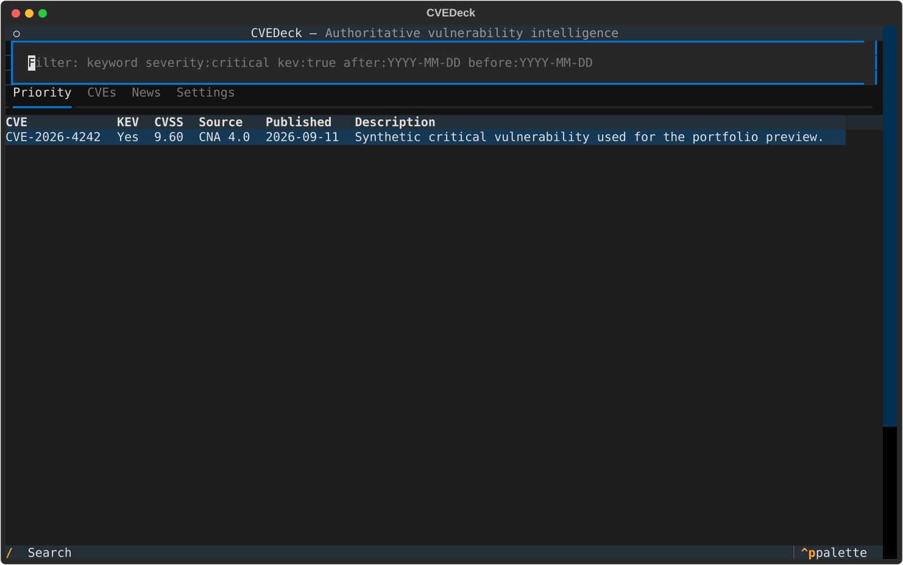

# CVEDeck

CVEDeck is a local Linux terminal dashboard for prioritizing authoritative CVE records, CISA Known Exploited Vulnerabilities (KEV), and security-news metadata. It is designed for learners and developers who want a clear, inspectable view without accounts, telemetry, scraping article pages, or AI-generated summaries.



> Status: portfolio-quality v0.1. Upstream APIs evolve; use `cvedeck status` to detect partial synchronization failures.

## What it does

- Discovers recent/modified CVEs through NVD and exploitation transitions through CISA KEV.
- Hydrates records from the CVE Program API as the authoritative source.
- Stores all available CNA and NVD CVSS scores separately and selects one with documented precedence.
- Prioritizes every KEV entry and CVEs at or above the configured threshold (9.0 by default).
- Associates feed articles only through exact CVE IDs in feed-provided titles/excerpts.
- Keeps cached data usable when individual sources fail.
- Silently baselines first-run findings; later `NEW_CRITICAL` and `BECAME_KEV` transitions can trigger desktop notifications.

CVEDeck is not a vulnerability scanner, patch manager, or real-time enterprise threat-intelligence service.

## Install

Requires Python 3.11+ and Linux.

```bash
uv tool install git+https://github.com/OnlyOneArthur/cvedeck
# or
pipx install git+https://github.com/OnlyOneArthur/cvedeck
```

For development:

```bash
git clone https://github.com/OnlyOneArthur/cvedeck
cd cvedeck
uv sync --extra dev
uv run cvedeck --offline
```

## Usage

```bash
cvedeck                 # open TUI; sync in background when due
cvedeck --offline       # cached data only
cvedeck tui             # explicit TUI command
cvedeck sync            # synchronize; nonzero exit on partial failure
cvedeck sync --notify   # synchronize and deliver pending transitions
cvedeck status          # show per-source health
```

TUI keys:

| Key | Action |
|---|---|
| `/` | Focus search/filter |
| `r` | Synchronize |
| `o` | Open selected authoritative/original URL |
| `y` | Copy selected URL |
| `q` | Quit (also inside previews/help; ordinary text in inputs) |
| `j` / `k` | Move rows or scroll preview |
| `gg` / `G` | First / last row or preview position (`gg` within 0.7 seconds) |
| `Enter` | Preview selected News, CVE, or Priority record |
| `Esc` | Close preview/help and restore previous focus |
| `?` | Context-aware keyboard help |
| `e` | Export selected/previewed record to Markdown |

Arrow keys and Tab/Shift+Tab retain native behavior. Letter shortcuts do not
intercept text inputs. News previews show publisher excerpts, not generated
summaries; CVE briefs show stored, sourced facts. Previews remain tied to their
record while background sync refreshes the tables. `o`/`y` target the preview's URL.

Exports default to `~/Documents/CVEDeck/exports`. Change **Export directory** in
Settings (`export_dir` in TOML); use `~/...` or an absolute path, never a relative
path. The directory is created only when exporting. Each export creates a new
ID-and-timestamp-named Markdown file without overwriting existing files. It includes
source links and an export timestamp, never configuration, API keys, or raw JSON.
Changing the directory affects future exports only.

Sync progress shows source stages, known processed counts, elapsed time, and
errors, never an estimated percentage. CLI progress goes to stderr; the final
summary stays on stdout. The TUI's source-health strip shows last successful sync
and errors; a recent sync does not guarantee upstream completeness. Quitting
interrupts background sync; interrupted work is not reported as complete.

The Settings tab validates and atomically writes the same TOML file users may edit manually.

## Configuration

`~/.config/cvedeck/config.toml`:

```toml
critical_cvss = 9.0
startup_sync_interval_hours = 0
desktop_notifications = false

[feeds]
krebs = true
the_hacker_news = true
securityweek = true
```

An interval of `0` means sync on every TUI launch. The NVD API key is environment-only:

```bash
export NVD_API_KEY='your-key'
```

It is never written to TOML or SQLite. Anonymous NVD access works more slowly because rate limits are respected.

Data lives at `~/.local/share/cvedeck/cvedeck.db`. XDG environment variables are honored.

## Scheduling

CVEDeck never edits your crontab and runs no daemon. A daily cron example:

```cron
17 7 * * * /home/YOU/.local/bin/cvedeck sync >>/home/YOU/.local/state/cvedeck-sync.log 2>&1
```

A systemd user timer example is in [`docs/scheduling.md`](docs/scheduling.md).

## Data quality and limitations

- A KEV listing confirms observed exploitation; absence from KEV does not mean safe.
- CVSS measures technical severity, not local business risk.
- Missing information is displayed as unavailable rather than inferred.
- Article relationships require exact CVE identifiers and can miss relevant stories that omit them.
- Feed metadata availability and wording are controlled by publishers.
- Older first-run KEVs are indexed immediately but hydrated lazily when later discovered/modified.

See [`docs/architecture.md`](docs/architecture.md), [`docs/legal.md`](docs/legal.md), and [`docs/specification.md`](docs/specification.md).

## Development verification

```bash
uv run pytest
uv run ruff check .
uv run mypy
uv build
```

Tests use synthetic fixtures; normal tests do not require network access.

## License

MIT. Upstream data and feeds retain their own terms; see [`docs/legal.md`](docs/legal.md).
